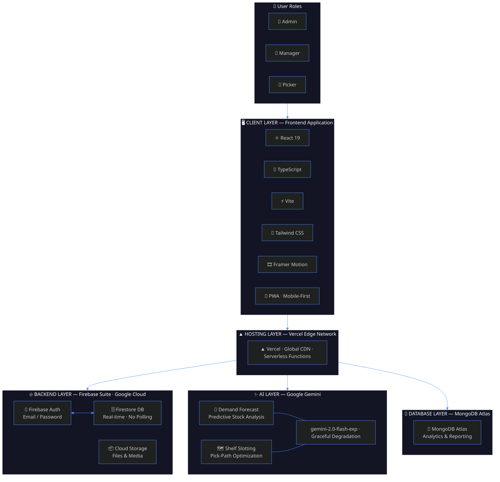

<div align="center">


# PickPulse

### Intelligent Dark Store Management Platform

**Real-time inventory · Smart picking · Compliance tracking · AI-powered insights**


<br/>

[](https://reactjs.org/)
[](https://www.typescriptlang.org/)
[](https://firebase.google.com/)
[](https://vitejs.dev/)
[](https://tailwindcss.com/)
[](LICENSE)
[](CONTRIBUTING.md)

<br/>

> A production-grade operations platform engineered for the speed of quick commerce.  
> Built to give dark store teams full visibility and control — from shelf to doorstep.

<br/>

### 🚀 [View Live Prototype →](https://pick-pulse-five.vercel.app)

[](https://pick-pulse-five.vercel.app)

</div>

---

## Table of Contents

- [Overview](#overview)
- [Live Demo](#live-demo)
- [Key Features](#key-features)
- [Tech Stack](#tech-stack)
- [Architecture](#architecture)
- [Getting Started](#getting-started)
  - [Prerequisites](#prerequisites)
  - [Installation](#installation)
  - [Environment Variables](#environment-variables)
- [Deployment (Vercel)](#deployment-vercel)
- [Firebase Setup](#firebase-setup)
  - [Security Rules](#security-rules)
- [Role-Based Access](#role-based-access)
- [Project Structure](#project-structure)
- [Contributing](#contributing)
- [Author](#author)

---

## Overview

PickPulse is a **mobile-first, real-time operations platform** built for dark stores and quick-commerce warehouses. It digitizes every layer of store operations — from live inventory tracking and picker coordination to compliance logging and AI-driven demand forecasting — into a single, unified interface optimized for speed and reliability.

Whether you're managing a team of pickers, auditing expiry dates, or trying to cut pick-path times, PickPulse gives you the tools to operate at 10-minute delivery speeds.

---

## Live Demo

> **Try it live — no setup required.**

| | |
|---|---|
| 🌐 **URL** | [https://pick-pulse-five.vercel.app](https://pick-pulse-five.vercel.app) |
| 🖥️ **Hosting** | Vercel (Edge Network) |
| 📱 **Optimized for** | Mobile & Desktop |
| 🔄 **Status** |  |

> The prototype is connected to a live Firebase backend. Features like real-time inventory updates, picker management, and compliance logs are fully functional.  
> AI forecasting features require a valid API key and may be limited in the demo environment.

---

## Key Features

### 📦 Real-Time Inventory Tracking
Live stock levels, expiry date management, and shelf location mapping — all synchronized through Firebase Firestore. Every adjustment is reflected instantly across all connected devices.

### 🤖 AI-Powered Demand Forecasting
Integrated AI analysis evaluates local context signals to predict demand surges and suggests optimal shelf slotting to minimize pick-path distances and reduce fulfillment times.

### 🧑‍🏭 Order & Picker Management
Track active pickers in real time, assign warehouse zones, monitor per-picker fulfillment metrics, and manage order queues from a single dashboard.

### 📷 Barcode & QR Scanning
Built-in scanner integration enables instant stock adjustments and item verification — no manual entry required, no errors introduced.

### 🌡️ Compliance & Ticketing
Log temperature checks, cleaning records, and operational issues (tickets) with timestamps and ownership. Stay audit-ready at all times.

### 🔐 Role-Based Access Control
Granular permissions for three roles — **Admin**, **Manager**, and **Picker** — ensuring each team member sees only what they need.

### 📱 Mobile-First UI
Fully responsive Progressive Web App experience engineered for handheld devices used in warehouse environments. Built with Tailwind CSS and Framer Motion.

---

## Tech Stack

| Layer | Technology |
|---|---|
| **Frontend Framework** | React 19 |
| **Language** | TypeScript |
| **Build Tool** | Vite |
| **Styling** | Tailwind CSS |
| **Animations** | Framer Motion |
| **Icons** | Lucide React |
| **Authentication** | Firebase Auth |
| **Database** | Cloud Firestore (Realtime) |
| **AI / ML** | Google Gen AI SDK |
| **Deployment** | Vercel |

---

## Architecture

```
┌─────────────────────────────────────────────────────┐
│                  PickPulse Client                   │
│           React 19 + TypeScript + Vite              │
└────────────────┬────────────────┬───────────────────┘
                 │                │
     ┌───────────▼──────┐  ┌──────▼────────────┐
     │  Firebase Suite  │  │   Google Gen AI   │
     │  ─────────────── │  │  ──────────────── │
     │  Authentication  │  │  Demand Forecast  │
     │  Firestore DB    │  │  Slotting Engine  │
     │  Real-time Sync  │  └───────────────────┘
     └──────────────────┘
```

Data flows in real-time — every inventory change, picker update, or compliance log is pushed to all connected clients via Firestore's live listeners, with no polling required.

---

## Getting Started

### Prerequisites

- **Node.js** `v18.x` or higher
- **npm** `v9.x` or higher
- A **Firebase** project (Firestore + Authentication enabled)
- A **Google AI** API key (for demand forecasting features)

### Installation

```bash
# 1. Clone the repository
git clone https://github.com/your-username/pickpulse.git
cd pickpulse

# 2. Install dependencies
npm install

# 3. Configure environment variables (see below)
cp .env.example .env.local

# 4. Start the development server
npm run dev
```

The app will be available at `http://localhost:5173`.

### Environment Variables

Create a `.env.local` file in the project root with the following variables:

```env
# Firebase Configuration
VITE_FIREBASE_API_KEY=your_firebase_api_key
VITE_FIREBASE_AUTH_DOMAIN=your_project.firebaseapp.com
VITE_FIREBASE_PROJECT_ID=your_project_id
VITE_FIREBASE_STORAGE_BUCKET=your_project.appspot.com
VITE_FIREBASE_MESSAGING_SENDER_ID=your_sender_id
VITE_FIREBASE_APP_ID=your_app_id

# AI Configuration
VITE_GEMINI_API_KEY=your_google_ai_api_key
```

> **Security Note:** Never commit `.env.local` to version control. Add it to `.gitignore` before your first commit.

---

## Deployment (Vercel)

PickPulse uses a flat file structure, making Vercel deployment straightforward — even from a mobile browser.

**Step 1:** Go to [vercel.com](https://vercel.com) and log in.

**Step 2:** Click **Add New → Project** and import your PickPulse GitHub repository.

**Step 3:** Before clicking Deploy, expand the **Environment Variables** panel and add each variable from your `.env.local` file. At minimum, you need:

| Variable | Description |
|---|---|
| `VITE_FIREBASE_API_KEY` | Firebase Web API Key |
| `VITE_FIREBASE_PROJECT_ID` | Your Firebase project ID |
| `VITE_GEMINI_API_KEY` | Google AI key for forecasting features |
| *(+ remaining Firebase vars)* | As listed in the section above |

**Step 4:** Click **Deploy**. Vercel will build and publish your app automatically.

> If `VITE_GEMINI_API_KEY` is not provided, the app will run normally but AI forecasting features will be silently disabled.

---

## Firebase Setup

### Enabling Services

In your [Firebase Console](https://console.firebase.google.com):

1. Enable **Authentication** → Sign-in method → Email/Password
2. Enable **Cloud Firestore** → Create database → Start in production mode
3. Apply the security rules below

### Security Rules

Navigate to **Firestore → Rules** in your Firebase Console and replace the default rules with:

```javascript
rules_version = '2';
service cloud.firestore {
  match /databases/{database}/documents {

    function isAuthenticated() {
      return request.auth != null;
    }

    function isAdmin() {
      return isAuthenticated() && (
        (
          exists(/databases/$(database)/documents/users/$(request.auth.uid)) &&
          get(/databases/$(database)/documents/users/$(request.auth.uid)).data.role == 'Admin'
        ) || (
          request.auth.token.email == "adityadeshakar@gmail.com" &&
          request.auth.token.email_verified == true
        )
      );
    }

    match /users/{userId} {
      allow read: if isAuthenticated();
      allow write: if isAdmin() || (isAuthenticated() && request.auth.uid == userId);
    }

    match /inventory/{itemId} {
      allow read: if isAuthenticated();
      allow write: if isAdmin();

      match /history/{historyId} {
        allow read, create: if isAuthenticated();
      }
    }

    match /{path=**} {
      allow read, write: if isAuthenticated();
    }
  }
}
```

---

## Role-Based Access

| Permission | Admin | Manager | Picker |
|---|:---:|:---:|:---:|
| View Inventory | ✅ | ✅ | ✅ |
| Adjust Stock | ✅ | ✅ | ❌ |
| Manage Users | ✅ | ❌ | ❌ |
| View Compliance Logs | ✅ | ✅ | ✅ |
| Create Tickets | ✅ | ✅ | ✅ |
| Resolve Tickets | ✅ | ✅ | ❌ |
| View AI Forecasts | ✅ | ✅ | ❌ |
| Manage Pickers | ✅ | ✅ | ❌ |

---

## Project Structure

```
pickpulse/
├── public/                 # Static assets
├── src/
│   ├── components/         # Reusable UI components
│   │   ├── inventory/      # Inventory management views
│   │   ├── pickers/        # Picker coordination UI
│   │   ├── compliance/     # Compliance & ticketing
│   │   └── shared/         # Common layout components
│   ├── hooks/              # Custom React hooks (Firebase, auth)
│   ├── lib/                # Firebase client, AI client, utilities
│   ├── pages/              # Top-level page components
│   ├── types/              # TypeScript interfaces & enums
│   └── main.tsx            # Application entry point
├── .env.example            # Environment variable template
├── index.html
├── tailwind.config.ts
├── tsconfig.json
└── vite.config.ts
```

---

## Contributing

Contributions, issues, and feature requests are welcome.

```bash
# Fork the repo, then:
git checkout -b feature/your-feature-name
git commit -m "feat: add your feature"
git push origin feature/your-feature-name
# Open a Pull Request
```

Please follow the existing code style and add tests where applicable.

---

## Author

<div align="center">

**Developed by Piyush Deshkar**

[](https://github.com/PiyushDeshkar)
[](https://linkedin.com/in/piyushdeshkar)

<br/>

*If PickPulse has been useful to you, consider leaving a ⭐ on the repository.*

</div>

---

<div align="center">
<sub>MIT License · © 2026 Piyush Deshkar</sub>
</div>
